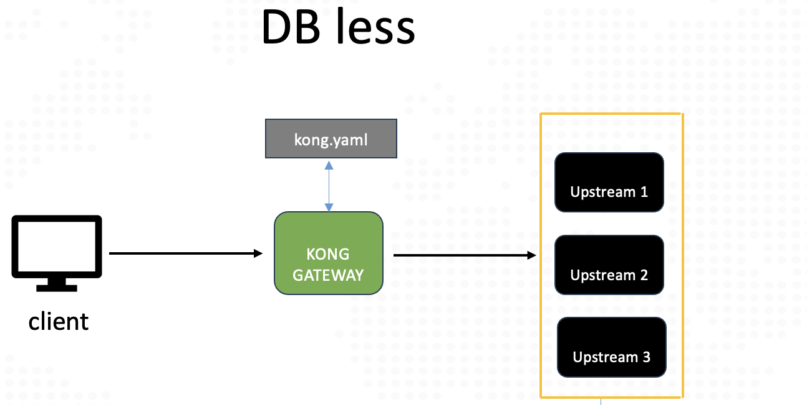
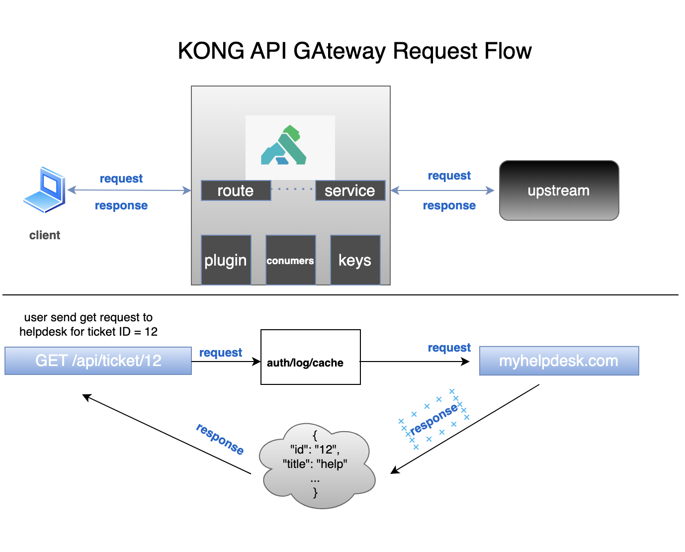

# Kong API Gateway - Practice Lab 

This is a Kong API Gateway OSS tutorial to install and configure with Docker.

## Table of Contents

1. [Introduction](#introduction)
2. [Prerequisites](#prerequisites)
3. [Deployment Topology](#deployment-topology)
4. [Deployment Modes](#deployment-modes)
5. [Lab Setup](#lab-setup)
6. [Kong Overview](#kong-overview)

## Introduction 

Welcome to the Kong API Gateway Practice Lab! In this tutorial, we'll guide you through various installation options and deployment topologies of Kong Gateway, a lightweight yet powerful API gateway.

Kong Gateway is known for its high performance and low resource demands, making it ideal for managing API traffic across different environments. This course is designed to provide hands-on experience with Kong, from installation to configuring and managing API gateways.

Throughout this training, you'll learn:

- How to install and configure Kong Gateway using Docker.
- Different deployment modes (DB-less, Traditional, Hybrid).
- How to manage and secure your APIs using Kong.

Let's get started!

## Prerequisites 

Before starting, ensure your environment meets the following prerequisites:

1. **Docker Community Edition**
   - Install Docker on your system: [Docker Installation Guide](https://docs.docker.com/engine/install/)
   
2. **cURL**
   - Command-line tool for transferring data: [cURL Installation Guide](https://everything.curl.dev/get)
   
3. **HTTPie**
   - A user-friendly HTTP client: [HTTPie Installation Guide](https://httpie.io/docs/cli/installation)
   
4. **deck**
   - Declarative configuration management tool for Kong: [deck Installation Guide](https://docs.konghq.com/deck/latest/installation/)
   
5. **Postman or Insomnia**
   - API testing tools: [Postman](https://www.postman.com/downloads/) or [Insomnia](https://insomnia.rest/download)

We will use Docker to pull Kong images for various deployment modes throughout this lab.

## Deployment Topology

Kong Gateway can be deployed in several modes, each suited for different environments and use cases:

- **DB-less and Declarative**
- **Traditional (Database)**
- **Hybrid**
- **Kong Konnect**

Each mode has its own benefits and limitations. Choose the mode that best fits your production needs.

### Deployment Modes Overview
| Mode            | Description                                 | Use Case                                |
|-----------------|---------------------------------------------|-----------------------------------------|
| **DB-less**     | Configuration via declarative file, no database needed | Simple setups, testing, or small-scale  |
| **Traditional** | Requires a database to store configurations | High scalability and enterprise environments |
| **Hybrid**      | Control plane and data plane separation     | Large, distributed environments         |
| **Kong Konnect**| Managed service for multi-cloud environments| Enterprise-level services               |

## Deployment Modes

  
DB-less Mode

  
  
  In DB-less mode, configuration is provided through a declarative file in YAML or JSON format. This mode is ideal for simple setups where a database is unnecessary.

  
Traditional Mode

  
  
  In Traditional mode, Kong Gateway requires a database to store configured entities like routes, services, and plugins. PostgreSQL 10+ is supported.

  
Hybrid Mode

  
  
  Hybrid mode separates the control plane and data plane, allowing distributed deployments without the need for a database on every node.

## Lab Setup

Follow these steps to set up your lab environment:

1. **Run `setup.sh`:** This script will start Kong in different modes (DB-less, Traditional, Hybrid). The script uses `docker-compose.yaml` to pull the latest Kong image.
2. **Verify the Setup:** Check the logs and ensure Kong is running in the desired mode.

For each mode, Docker Compose will set up the necessary containers, networks, and volumes. Feel free to modify `docker-compose.yaml` to fit your specific needs.

## Kong Overview

Kong Gateway offers several core features:

- **Services:** Manage your upstream services with ease. Ideal for small-scale or testing environments.
- **Routes:** Route incoming requests to the correct upstream service. Supports high availability and scalability.
- **Plugins:** Enhance your APIs with built-in and custom plugins. Perfect for large, distributed environments.

Kong is designed to be flexible and scalable, making it suitable for a variety of use cases, from small projects to enterprise-level deployments.

---

This README is now fully enhanced with the image links you provided. Ensure that these images are accessible and correctly linked in your GitHub repository. If you need further adjustments or have any other questions, feel free to ask!
